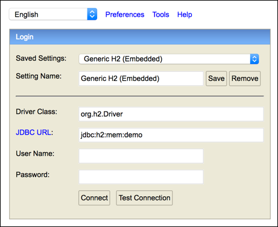
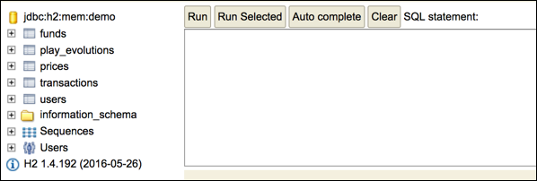
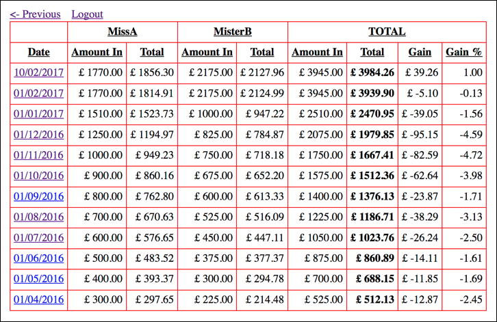
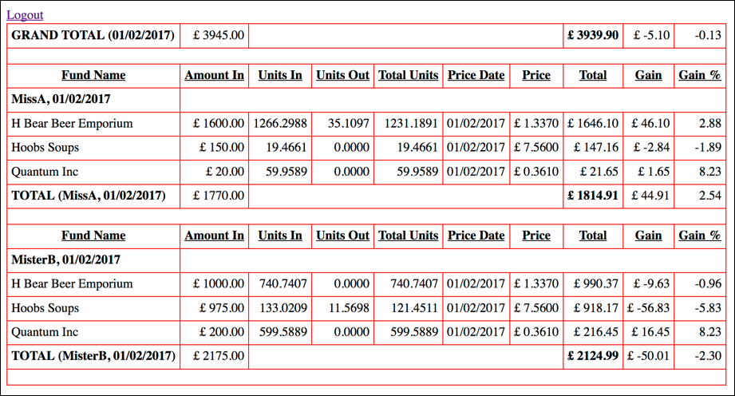
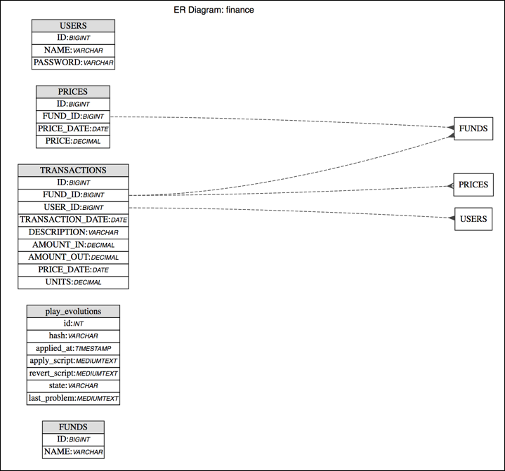

# financeGadget #

TODO: Add need to set $USER env var, otherwise UserSpec (and other tests) fail to run...

## Background ##

financeGadget is a Scala web application to view share investment portfolio information.

I can log in to my existing financial website at any time, and:

* view the current value of my portfolio
* view the last 3 months' worth of transactions

However, I also want to view additional information, such as:

* how much I have invested
* how the value of my investments has changed over time
* which investment funds are performing badly

The financeGadget webapp provides this additional functionality, once the data has been extracted from my financial web
site and stored in the database. For example, the portfolio page shows all of the user's investments on a specific date:

<br/>


<br/>

## Architecture ##

The system consists of the following components:

* A **sql database** to hold the investment data.

* A **database persistence layer**, based on Slick, to store and retrieve the investment data.

* A **play webapp** which retrieves the information from the database and displays it to the user. The web application
 can be started in two modes:
    * [Demo mode](#demo_mode). The database is loaded with example user accounts and financial data for demonstration
    purposes. See details below for how to start the webapp in demo mode.

    * [Normal mode](#normal_mode). In this mode the application displays data extracted from the real financial website.
    The database is initially loaded with user accounts only. The real financial data is then loaded into database via
    the [website scrapers](#website_scrapers), and, if needed, the [database reloader](#database_reloader).

<br/>

## <a name="demo_mode"></a>Demo Mode ##

### Getting and Building the Code ###

1. Install the following pre-requisites:

   * [sbt 1.0.1](http://www.scala-sbt.org/1.x/docs/Setup.html)

2. Clone this repo:

   ```
   $ git clone https://github.com/ludwiggj/financeGadget.git

   $ cd financeGadget
   ```

3. Run the sbt build tool, build the code and run the tests:
   ```
   $ sbt
   [info] Loading settings from idea.sbt ...
   ...
   [info] sbt server started at 127.0.0.1:5072
   [finance] $
   [finance] $ ;clean;test
   ```

   The database integration tests within the test suite are run against the
   [H2 in-memory database](http://www.h2database.com).

<br/>

### Starting the Demo ###

1. Run the sbt build tool:
   ```
   $ sbt
   [info] Loading settings from idea.sbt ...
   ...
   [info] sbt server started at 127.0.0.1:5072
   [finance] $
   ```

2. Start the h2 browser from the sbt prompt.

   (_NOTE_: This step is not required to run the demo, but should be run at this point if you wish to view the h2
   in-memory database that underpins the demo; see step 7 below for details).

   ```
   [finance] $ h2-browser
   TCP server running at tcp://localhost:9092 (only local connections)
   PG server running at pg://localhost:5435 (only local connections)
   Web Console server running at http://localhost:8082 (only local connections)
   [finance] $
   ```
   This loads the H2 console in a browser window:

   

   Do not log into the console at this stage.

3. Start the web application from sbt:

   ```
   $ [finance] run -Dconfig.file=conf/demo/demo.conf -Dlogger.file=conf/demo/logback-demo.xml

   [info] Loading settings from idea.sbt ...
   ...

   --- (Running the application, auto-reloading is enabled) ---

   [info] p.c.s.AkkaHttpServer - Listening for HTTP on /0:0:0:0:0:0:0:0:9000

   (Server started, use Enter to stop and go back to the console...)
   ```

4. Open the [finance gadget home page](http://localhost:9000).

5. Sign in to the application; see the [Demo User Accounts](#demo_user_accounts) below for account details.

6. For details of the demo functionality see [Investment Summary Page](#investment_summary_page) and
   [Portfolio Page](#portfolio_page) below.

7. The demo data is loaded into the [H2 in-memory database](http://www.h2database.com). To view the underlying data,
   press the "Connect" button on the H2 console login page displayed when running the command in step 2 above. The
   schema is displayed on the left-hand side of the logged in page:

   

   The play_evolutions table shows the sql statements used to load the other tables; funds, prices, transactions and
   users.

8. To stop the demo, halt the web application by pressing Enter at the sbt console:
   ```
   [success] Total time: 677 s, completed 04-Nov-2017 21:54:57
   [INFO] [11/04/2017 21:54:57.870] [Thread-2] [CoordinatedShutdown(akka://sbt-web)] Starting coordinated shutdown from JVM shutdown hook
   $
   ```

<br/>

### <a name="demo_user_accounts"></a>Demo User Accounts ###

The application requires the user to log in. There are three available accounts:

| Username | Password | Notes                                          |
|    ---   |    ---   |  ---                                           |
| MissA    | A        | Can view her own data only.                    |
| MisterB  | B        | Can view his own data only.                    |
| Admin    | Admin    | Can view investments of both MissA and MisterB |

<br/>

### <a name="investment_summary_page"></a>Investment Summary Page - Single User View ###

Following a successful login (in this case of _Miss A_), the investment summary page is displayed:


This shows a list of **investment dates**, and the total value of the user's portfolio on each date. The investment date
is the regular monthly date (the 1<sup>st</sup> in this example) on which the user's money is used to buy new shares in
one or more funds. Thus the summary page shows how the user's portfolio has built up over time.

If any additional transactions have occurred since the most recent investment date, then for each such transaction the
date is displayed together with the value of the user's portfolio on that date.

The dates are shown in reverse order, from the most recent date backwards. If there are too many rows to show on
one page additional links are provided to support navigation between each page of results.

<br/>

### Investment Summary Page - Admin View ###

The admin login enables the administrator to view the investments of all other users on a single page. The
investments are totalled so that the changes in the total portfolio value can be viewed over time.



<br/>

### <a name="portfolio_page"></a>Portfolio Page ###

Clicking on a specific date to loads the portfolio page, which shows a detailed breakdown of the user's investments on
the chosen date. As per the Investment Summary Page, the Portfolio Page can display the investments for a single user,
or all users if the administrator is logged in.

An example of the Portfolio Page in administrator mode is shown below:



<br>

## Database Schema ##

The database schema is normalised; the key representations (users, prices, transactions and funds) are stored in
separate tables:

// TODO - Update schema diagram



The **play_evolutions** table is used by the play evolutions component, which manages the deployment and versioning of
database schema changes.

<br>

## Database Persistence Layer ##

This is implemented via slick. See the
[Tables definition](app/models/org/ludwiggj/finance/persistence/database/Tables.scala) and the corresponding
[domain classes](app/models/org/ludwiggj/finance/domain).

<br>

## Play Web Application ##

The application retrieves the investment data via the persistence layer. The data is converted into "higher value" domain
representations, such as:

* [HoldingSummary](app/models/org/ludwiggj/finance/domain/HoldingSummary.scala) - the current
value of shares held in a single fund by a user, including gain/loss information
* [Portfolio](app/models/org/ludwiggj/finance/domain/Portfolio.scala) - all of the funds held by a user on a particular
date, including gain/loss information across the whole portfolio.

<br>

## Key Technologies ##

* Scala 2.12.3.

* sbt 1.0.1

* MySql 5.6.22.

* H2 in-memory database 1.4.192.

* Slick 3.2.0, to create the database persistence layer.

* Play 2.6.6, to provide the web front end.

* Play slick 3.0.1, to integrate slick with play.

* Circe 0.9.3, for parsing Json. This is used to parse the Json returned by the investment management platform.

* Typesafe config 1.3.2, to store details of the accounts used to access the investment management platform.

* ScalaTest 3.0.4 & Play ScalaTestPlus 3.1.2,

<br>

## <a name="normal_mode"></a> Appendix - Normal Mode ##

When the play webapp is run in normal mode it is used to view real financial data. It differs from the demo mode as
follows:

 * Whilst the database schema is identical, normal mode uses a MySql database.
 * The real financial data is loaded into database manually via the [website scrapers](#website_scrapers).
 * A pre-requisite for running the [website scrapers](#website_scrapers) is the creation of a
 [config file](conf/acme.conf) that identifies financial information to be extracted; namely the URL of the financial
  website and account details. The config file must be based on [this template](conf/site.conf).
 * Obviously the real config file I use to access my financial information is not stored in GitHub!

The following section describes how to start the webapp in normal mode, and how to run the
[Website Transaction Scraper](#website_transaction_scraper) and [Website Holding Scraper](#website_holding_scraper) to
load the financial data into the database, for viewing via the webapp.

Note that to build up a history of investment data (which can then be viewed via the
[Investment Summary Page](#investment_summary_page) and [Portfolio Page](#portfolio_page)), it is only necessary to
periodically load the financial transaction and holding data into the database via the website scrapers. Whilst this
must currently be done manually it could easily be automated to run at set times.

<br/>

### Running in Normal Mode ###

1. It is assumed that the code has already been downloaded and run in [demo mode](#demo_mode).

2. Install the following pre-requisites:

   * [MySql Community Server 5.6.x](https://dev.mysql.com/downloads/mysql/5.6.html#downloads)

3. Start the mysql server.

   ```
   $ /usr/local/mysql/support-files/mysql.server start

   Starting MySQL
   . SUCCESS!
   $
   ```

   This assumes that you are running on a Mac; see
   [this page](http://osxdaily.com/2014/11/26/start-stop-mysql-commands-mac-os-x/) for further details. The exact
   details will vary depending on your target operating system.

4. Check that you can log in and get the mysql> prompt:
   ```
   $ /usr/local/mysql/bin/mysql

   Welcome to the MySQL monitor.  Commands end with ; or \g.
   Your MySQL connection id is 85
   Server version: 5.6.37 MySQL Community Server (GPL)

   ...

   mysql>
   ```

   Log out via 'exit'.

   ```
   mysql> exit
   Bye
   $
   ```

5. Create the database schema from the directory containing this README file:

   ```
   $ . ./conf/db/dbdeploy.sh

   --------------
   DROP DATABASE IF EXISTS finance
   --------------

   --------------
   CREATE DATABASE finance
   --------------

   --------------
   CREATE DATABASE IF NOT EXISTS finance
   --------------

   --------------
   GRANT ALL PRIVILEGES ON finance.* TO 'finance'@'localhost' IDENTIFIED BY 'gecko'
   --------------

   --------------
   FLUSH PRIVILEGES
   --------------

   $
   ```

6. Create a user environment variable USER_HOME, and point it to your home directory. For example, on a Mac:
   ```
   $ export USER_HOME=~
   ```

7. Start the web application from sbt:

   ```
   $ sbt
   ...
   [finance] $ run -Dlogger.file=conf/logback.xml

   --- (Running the application, auto-reloading is enabled) ---

   [info] p.c.s.AkkaHttpServer - Listening for HTTP on /0:0:0:0:0:0:0:0:9000

   (Server started, use Enter to stop and go back to the console...)
   ```

8. Open the [finance gadget home page](http://localhost:9000). This creates the database schema (via play evolutions)
   and also creates the [normal mode user accounts](#normal_mode_user_accounts).

9. The database contains no financial data at this point. Thus if you sign in to the application at this stage using
   one of the [normal mode user accounts](#normal_mode_user_accounts) you will see the message
   "You have no investments!".

10. Halt the web application by pressing Enter at the sbt console:
    ```
    [success] Total time: 677 s, completed 04-Nov-2017 21:54:57
    [INFO] [11/04/2017 21:54:57.870] [Thread-2] [CoordinatedShutdown(akka://sbt-web)] Starting coordinated shutdown from JVM shutdown hook
    $
    ```

11. Create the following sub-directories in the directory containing this README file: holdings, prices and transactions:

    ```
    $ mkdir holdings
    $ mkdir prices
    $ mkdir transactions
    ```

    These directories will store the financial data retrieved by the [website scrapers](#website_scrapers).

12. Load the financial transaction data into the database:

    * Create a [config file](conf/acme.conf) containing the details of the financial website URL and account details to
    use, based on [this template](conf/site.conf).

    * Run the website transaction scraper from sbt:
      ```
      [finance] $ runMain utils.WebSiteTransactionScraper
      ...
      [success] Total time: 16 s, completed 06-Nov-2017 13:12:29
      ```

    This writes the transaction data into the database and persists it to disk; see
    [Website Transaction Scraper](#website_transaction_scraper) for more details.

13. Load the financial holdings data into the database:

    * It is assumed that the [config file](conf/acme.conf) exists, as per the previous step.

    * Run the website holding scraper from sbt:
      ```
      [finance] $ runMain utils.WebSiteHoldingScraper
      ...
      [success] Total time: 16 s, completed 06-Nov-2017 13:12:29
      ```

    This writes the holding data into the database and persists it to disk; see
    [Website Holding Scraper](#website_holding_scraper) for more details.

    Whilst the [Website Holding Scraper](#website_holding_scraper) persists both prices and holding information to flat
    files, only the price information is persisted to the database. This is because the application only requires the
    transaction and price data in order to build up the investment history displayed by the webapp.
    
14. Restart the webapp via sbt, open the [finance gadget home page](http://localhost:9000), and log in using one of the
[normal mode user accounts](#normal_mode_user_accounts). This time you should see the
[Investment Summary Page](#investment_summary_page) which displays a summary of the financial data you have extracted
and loaded.

15. To shutdown,

  * halt the web application by pressing Enter at the sbt console:
    ```
    [success] Total time: 677 s, completed 04-Nov-2017 21:54:57
    [INFO] [11/04/2017 21:54:57.870] [Thread-2] [CoordinatedShutdown(akka://sbt-web)] Starting coordinated shutdown from JVM shutdown hook
    $
    ```

  * and stop the MySql server:
    ```
    $ /usr/local/mysql/support-files/mysql.server stop
    Shutting down MySQL
    . SUCCESS!
    $
    ```

16. If the database needs to be reloaded (e.g. if the data is lost) the [database reloader](#database_reloader) can be run
 manually from sbt.

<br>

### <a name="normal_mode_user_accounts"/></a>Normal Mode User Accounts ###

The application requires the user to log in. There are three available accounts in normal mode:

| Username | Password | Notes                                          |
|    ---   |    ---   |  ---                                           |
| Me       | Me       | Can view his/her own data only.                |
| Spouse   | Spouse   | Can view his/her own data only.                |
| Admin    | Admin    | Can view investments of both Me and Spouse     |

<br>

### <a name="website_scrapers"></a> Website Scrapers ###

The **website scrapers** log in to the existing financial website, scrape the investment data and persist it into the
database. The data is also persisted into local file storage (flat files) as a backup.

#### <a name="website_transaction_scraper"></a> Website Transaction Scraper ####

The [WebSiteTransactionScraper](app/utils/WebSiteTransactionScraper.scala) retrieves details of the real web site user
accounts from a typesafe config file based on [this template](conf/site.conf). The real config file is not stored in
github for obvious reasons.

The scraper logs in to the financial web site as each user, retrieving the details of the latest financial transactions
for each one. If the config file lists multiple accounts then each one is processed in parallel via Futures. The
format of the scraped transaction data is shown below:

| Holding                  | Date       | Category                 | In (GBP) | Out (GBP) | Price date | Price(p) | Units/Shares | Int charge (GBP) |
| :----------------------- | :--------- | :----------------------- | :------- | :-------- | ---------- | --------:| ------------:| ---------------- |
| H Bear Beer Emporium     | 25/09/2015 | Investment Regular       | 200.00   |           | 25/09/2015 | 1,344.54 | 14.8750      |                  |
| Quantum Inc              | 11/09/2015 | Sale for Regular Payment |          | 25.67     | 11/09/2015 | 136.40   | 18.8187      |                  |

Each scraped transaction is persisted as follows:

* A row is written to the TRANSACTIONS database table.

* A row is written to a transactions flat file. A file is created in the **transactions** directory for each user with
the name:

  **txs_YY_MM_DD_\<userName\>.txt**

  where **userName** is the name of the user. The file contains the recent transactions for the named user up to and
including the specified date.

Currently the WebSite Transaction Scraper is triggered manually.

<br>

#### <a name="website_holding_scraper"></a> Website Holding Scraper ####

The [WebSiteHoldingScraper](app/utils/WebSiteHoldingScraper.scala) retrieves details of the real web site user accounts
from a typesafe config file. The real config file is not stored in github for obvious reasons; the format of the file
is based on [this template](conf/site.conf).

The scraper logs in to the investment management web site as each user, and retrieves details of the user's current
holdings. If the config file lists multiple accounts then each one is processed in parallel via Futures. The format of
the holdings is:

| Holding              | Units/Shares | Price date | Price(p) | Value(GBP)|
| :------------------- |-------------:| ----------:| --------:| ---------:|
| H Bear Beer Emporium | 1,912.0785   | 09/10/2015 | 132.1200 | 2,526.24  |
| Quantum Inc          | 2,468.3505   | 09/10/2015 | 199.5000 | 4,924.36  |

Each scraped holding is persisted as follows:

* A row is written to the PRICES database table.

* A row is written to a holdings flat file. A file is created in the **holdings** directory for each user with the name:

  **holdings_YY_MM_DD_\<userName\>.txt**

  where **userName** is the name of the user. The file contains the holdings for the named user on the specified date.

* A row is written to a prices flat file. A file is created in the **prices** directory for each user with the name:

  **prices_YY_MM_DD_\<userName\>.txt**

  where **userName** is the name of the user. The file contains the prices of the holdings for the named user on the
  specified date.

Currently the WebSite Holding Scraper is triggered manually.

<br>

### <a name="database_reloader"></a> Database Reloader ###

The **database reloader** reloads the financial information into the MySql database from the flat files created by the
[website scrapers](#website_scrapers).

It cleans out the MySql database, parses the flat files, and saves the resulting data into the Mysql database via the
persistence layer.

It is run manually from sbt:

```
[finance] $ runMain utils.DatabaseReload
```

The database reloader is not as important as it once was, as all tests and the demo are now run against the h2 database.
However, it's still nice to know that the data can be reloaded into the database at any time.

<br>

Graeme Ludwig, 17/10/17.


TODO: (README)

Identify all "Unidentified" transactions in persisted files...

Update relevant details from MySQL installation...

MySQL Installer
 https://dev.mysql.com/downloads/windows/installer/5.6.html
 (mysql-installer-community-5.6.40.1.msi)
 Installed server only...
 It insisted I set admin password (set to password)

Added sql directory to PATH

mysql --host=localhost --user=root --password=password
SET PASSWORD FOR root@localhost=PASSWORD('');

So can now do:

mysql
mysql -u=root

bash dbdeploy.sh